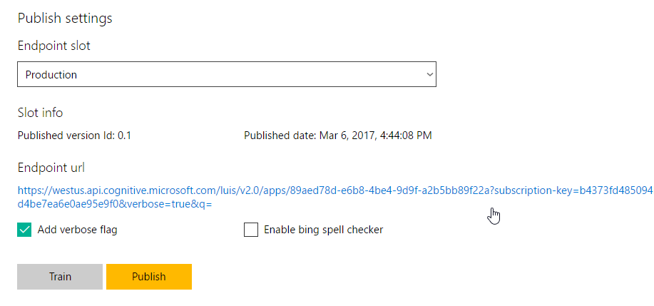

# LUIS Bot Sample

A sample bot integrated with a LUIS.ai application for understanding natural language.

## Prerequisites

The minimum prerequisites to run this sample are:

- Latest Node.js with NPM. Download it from [here](https://nodejs.org/en/download/).
- May require `npm install -g windows-build-tools` run in Administrator Windows Powershell for dtrace-provider errors during `npm install`
- The Bot Framework Emulator. To install the Bot Framework Emulator, download it from [here](https://emulator.botframework.com/). Please refer to [this documentation article](https://github.com/microsoft/botframework-emulator/wiki/Getting-Started) to know more about the Bot Framework Emulator.
- **[Recommended]** Visual Studio Code for IntelliSense and debugging, download it from [here](https://code.visualstudio.com/) for free.

### LUIS Application

The first step to using LUIS is to create or import an application. Go to the home page, www.luis.ai, and log in. After creating your LUIS account you'll be able to Import an Existing Application where can you can select a local copy of the LuisBot.json file an import it.


Once you imported the application, you'll need to train the app ([Training](https://docs.microsoft.com/en-us/azure/cognitive-services/luis/train-test)) then publish the app to an HTTP endpoint. For more information, take a look at [Publishing a Model](https://docs.microsoft.com/en-us/azure/cognitive-services/luis/publishapp).

Finally, edit the [.env](.env#L6) file and update the `LUIS_MODEL_URL` variable with your's app endpoint URL from the Publish page.

### Where to find the Endpoint URL

In the LUIS application's dashboard, click the **Publish App** button in the left side bar, select an Endpoint Key and then click the **Publish** button. After a couple of moments, you will see a URL that makes your app available as a web service.



## Code Highlights

One of the key problems in human-computer interactions is the ability of the computer to understand what a person wants, and to find the pieces of information that are relevant to their intent. In the LUIS application, you will bundle together the intents and entities that are important to your task. Read more about [Planning an Application](https://docs.microsoft.com/en-us/azure/cognitive-services/LUIS/plan-your-app) in the LUIS Help

### Intent Recognizers

The BotBuilder Node SDK contains Recognizer plugins that allow to detect intention from user messages using different methods, from Regex to natural language understanding. These Recognizer plugins and the IntentDialog are useful for building more open ended bots that support natural language style understanding.

Out of the box, Bot Builder comes with a [LuisRecognizer](https://docs.botframework.com/en-us/node/builder/chat-reference/classes/_botbuilder_d_.luisrecognizer) that can be used to call a machine learning model you have trained via the [LUIS web site](https://www.luis.ai/). You can create a LuisRecognizer that is pointed at your model and then pass that recognizer to an IntentDialog at creation time using the [options](https://docs.botframework.com/en-us/node/builder/chat-reference/interfaces/_botbuilder_d_.iintentdialogoptions) structure, or you can register a global recognizer that will listen to every user message and detect intention. Check out how to [register a global LuisRecognizer](app.js#L23-L25):

```javascript
// You can provide your own model by specifing the 'LUIS_MODEL_URL' environment variable
// This Url can be obtained by uploading or creating your model from the LUIS portal: https://www.luis.ai/
const recognizer = new builder.LuisRecognizer(process.env.LUIS_MODEL_URL);
bot.recognizer(recognizer);
```

Intent recognizers return matches as named intents. To match against an intent from a recognizer you pass the name of the intent you want to handle to [IntentDialog.matches()](https://docs.botframework.com/en-us/node/builder/chat-reference/classes/_botbuilder_d_.intentdialog#matches) or use the dialog's [triggerAction()](https://docs.botframework.com/en-us/node/builder/chat-reference/classes/_botbuilder_d_.intentdialog.html#triggeraction) by specifing the intent name with [matches](https://docs.botframework.com/en-us/node/builder/chat-reference/interfaces/_botbuilder_d_.itriggeractionoptions.html#matches) property. See how the bot matches the [`SearchHotels`](app.js#L77), [`ShowHotelsReviews`](app.js#L98) and [`Help`](app.js#L104) intents.

```javascript
bot
  .dialog("SearchHotels", [
    // ... waterfall dialog ...
  ])
  .triggerAction({
    matches: "SearchHotels"
  });

bot
  .dialog("Help", session => {
    // ...
  })
  .triggerAction({
    matches: "Help"
  });
```

### Spelling Correction

If you want to enable spelling correction, set the `IS_SPELL_CORRECTION_ENABLED` key to `true` in the [.env](.env#L14) file.

Microsoft Bing Spell Check API provides a module that allows you to to correct the spelling of the text. Check out the [reference](https://dev.cognitive.microsoft.com/docs/services/56e73033cf5ff80c2008c679/operations/56e73036cf5ff81048ee6727) to know more about the modules available.

> The features used in this sample are fully supported in the following channels:
>
> - Skype
> - Facebook
> - Microsoft Teams
> - DirectLine
> - WebChat
> - Slack
> - GroupMe
> - Telegram
>
> They are also supported, with some limitations, in the following channels:
>
> - Kik
> - Email
>
> On the other hand, they are not supported and the sample won't work as expected in the following channel:
>
> - SMS
